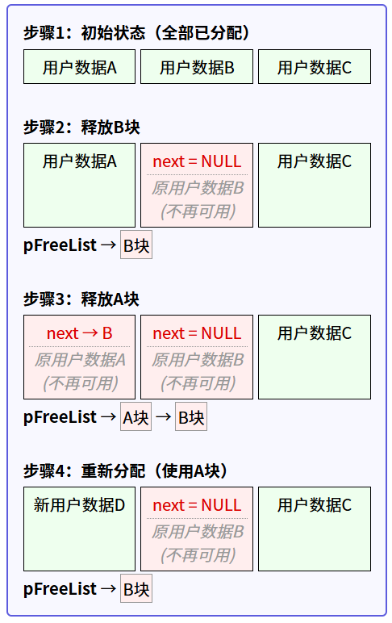
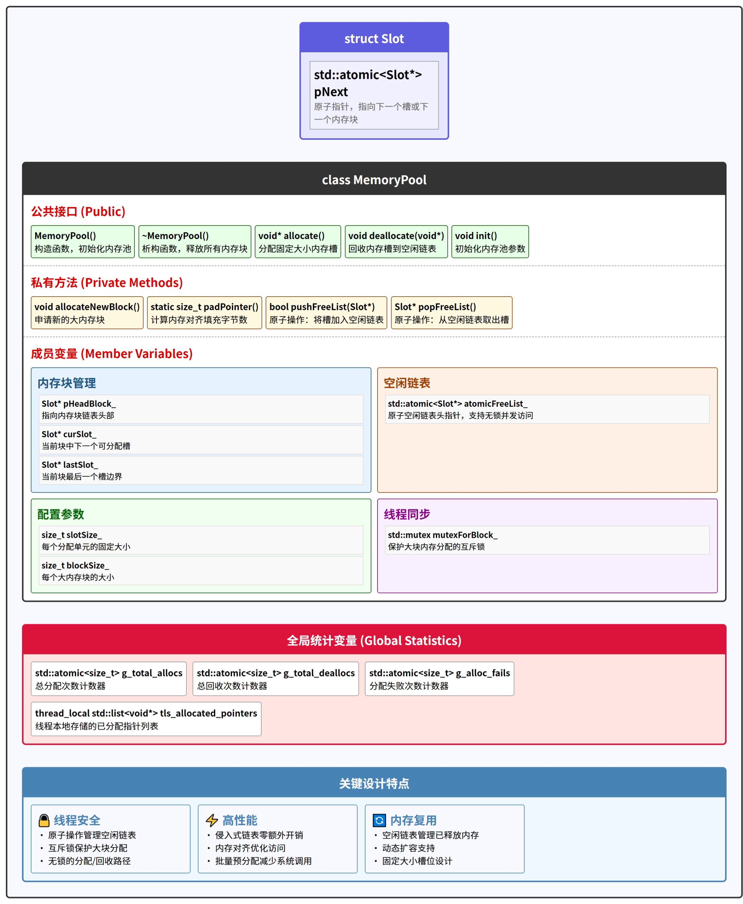
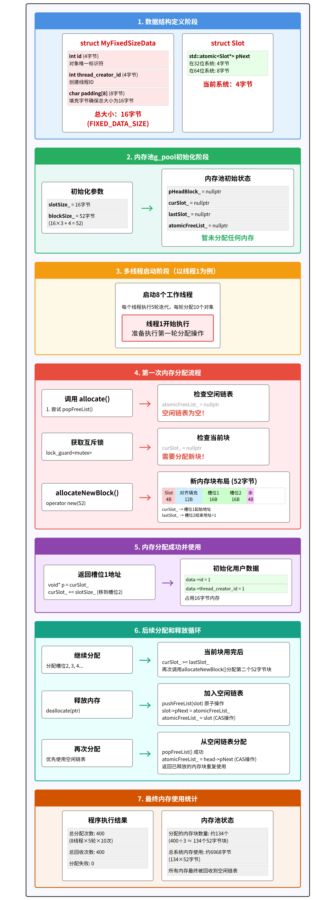

# memory_pool

## 什么是内存池？

内存池是一种预分配内存并进行重复利用的技术，通过减少频繁的动态内存分配与释放操作，从而提高程序运行效率。内存池通常预先分配一块大的内存区域，将其划分为多个小块，每次需要分配内存时直接从这块区域中分配，而不是调用系统的动态分配函数（如`new`或`malloc`）。简单来说就是**申请一块较大的内存块(**不够继续申请)，之后将这块内存的管理放在应用层执行，减少系统调用带来的开销。

### 为什么要做内存池

- 性能优化
  - **减少动态内存分配开销**：系统调用 malloc/new 和 free/delete 进行内存管理操作复杂，性能低。而内存池通过预分配内存，并以简单管理逻辑，能显著提升内存分配和释放效率。比如在一个频繁创建和销毁小对象的程序中，使用系统调用分配内存会因复杂操作导致效率低下，内存池则可避免此问题。
  - **避免内存碎片**：动态分配内存时，尤其是大量小对象频繁分配和释放，程序长时间运行会因申请内存块大小不定，产生大量内存碎片，降低程序和操作系统性能。内存池通过管理固定大小内存块，可有效防止碎片化。例如在图形渲染程序中，若频繁创建和销毁小的图形元素，使用内存池可避免内存碎片。
  - **降低系统调用频率**：像 malloc 这类系统级内存分配需进入内核态，频繁调用开销大。内存池减少系统调用频率，从而提高程序效率。例如在高并发的网络服务器中，若频繁使用系统调用分配内存，会因内核态切换开销大，而内存池可减少这种开销。
- **确定性（实时性）**：**稳定的分配时间**，使用内存池能让分配和释放操作耗时更可控、稳定，适用于对实时性要求严格的系统。如在自动驾驶汽车的实时控制系统中，需保证内存分配时间稳定，内存池就能满足这一需求。

### 内存池的应用场景

- 高频小对象分配
  - **游戏开发**：游戏中像粒子、子弹、NPC 等大量小对象频繁动态分配和释放，使用内存池可优化性能。例如在一款射击游戏中，大量子弹对象的创建和销毁，内存池可提升处理效率。
  - **网络编程**：网络编程里大量请求和响应对象（如消息报文）频繁创建和销毁，适合用内存池。如在一个高并发的 Web 服务器处理 HTTP 请求时，消息报文的处理可借助内存池。
  - **内存管理库**：一些容器或数据结构（如 std::vector 或 std::deque）内部可能用内存池优化分配性能。比如在使用 std::vector 存储大量小数据时，内存池可优化其内存分配。
- **实时系统**：在嵌入式设备或实时控制系统中，动态内存分配延迟可能影响实时性，内存池能提供确定性分配性能。例如在工业自动化控制的嵌入式系统中，内存池可确保实时响应。
- **高性能计算**：高性能计算程序中，频繁内存分配和释放影响性能，内存池可优化内存管理。比如在气象模拟这类高性能计算程序中，内存池可提升整体性能。
- **服务器开发**：数据库服务器、web 服务器等管理大量连接和请求，涉及大量内存分配，内存池能提升服务器性能。如大型数据库服务器处理大量客户端连接时，内存池可优化内存使用。

### 内存池在代码中的应用

- **替换动态开辟内存的系统调用**：对 new/malloc/delete/free 等系统调用进行替换，使用内存池机制来管理内存。例如在一个自定义的内存管理模块中，用内存池的函数替代系统的 new 和 delete 操作。
- **替换 STL 容器空间配置器**：对 STL 众多容器中的空间配置器 std::allocator 进行替换，使 STL 容器使用内存池的方式分配内存。比如让 std::vector 使用内存池分配内存，提高其性能。

### 内存池的缺点

- **初始内存占用**：内存池需预先分配较大内存区域，可能造成部分内存浪费。比如在一个小型程序中，预先分配了较大内存池，但实际使用量很少，就浪费了内存。

- **复杂性**：实现和调试内存池代码比直接使用 malloc/new 更复杂。例如内存池的内存分配算法、回收机制等实现起来较为复杂，调试时也更困难。

- **不适合大型对象**：对于大对象的分配，使用内存池可能不划算。比如在处理大型图像数据时，使用内存池可能不如直接使用系统内存分配高效。

## 实现步骤

从一个实际的需求场景出发，逐步构建和优化这个内存池项目。

### 背景与需求

假设你正在开发一个高性能的网络服务器。这个服务器需要处理大量的客户端连接，并且为每个连接或每个请求，都需要动态地创建和销毁一些小对象。比如：

- 为每个传入的数据包创建一个临时的`Packet`对象来存储信息。
- 为每个用户的短期会话创建一个`SessionInfo`对象。
- 在处理逻辑中，可能需要一些小块的缓冲内存。

这些对象的特点是：

1. **体积小**：可能只有几十或几百字节。
2. **生命周期短**：创建后很快就被销毁。
3. **申请释放频繁**：在高并发或高吞吐量的场景下，这种小对象的申请和释放会非常非常多。

**遇到的问题：** 如果直接使用C++的 `new` 和 `delete` (或者C语言的 `malloc` 和 `free`) 来管理这些小对象，可能会遇到性能瓶颈。因为：

- **系统调用开销**：`new/delete` 底层通常会涉及到操作系统内核的调用，这有固定的开销。
- **内存碎片**：频繁申请和释放不同大小的小块内存，容易导致内存碎片，使得后续难以找到合适大小的连续内存块。
- **查找开销**：通用的内存分配器为了管理整个堆内存，其内部查找可用内存块的算法可能对于小对象来说过于复杂和耗时。
- **多线程竞争**：在多线程环境下，全局的堆分配器通常需要加锁来保证线程安全，这会成为并发瓶颈。

**我们的初步目标：** 为了解决这个问题，我们希望设计一个**内存池 (Memory Pool)**。它的基本思想是：一次性向操作系统申请一大块内存，然后在这块大内存中手动管理小块内存的分配和回收。这样可以绕开大部分系统调用，减少碎片，并可能实现更高效的分配策略。

### 一、简单内存池，只分配，不回收的内存块

创建一个最基础的内存分配器，它能从预先分配的一大块内存中切出小块内存。为了简化，我们暂时不考虑内存回收和线程安全问题。

#### SimpleMemoryBlock.h

```c++
#pragma once

#include<iostream>

class SimpleMemoryBlock
{
public:
	SimpleMemoryBlock() noexcept = default;
	SimpleMemoryBlock(size_t blockSize = 4096);

	~SimpleMemoryBlock();

	void* allocate(size_t size);

private:
	char* pBlock;         // 指向内存块的指针
	size_t blockSize;   // 内存块的总大小
	char* pCurrent;   // 指向当前可分配位置的指针
};
```

#### SimpleMemoryBlock.cpp

```c++
#include "SimpleMemoryBlock.h"
// #include <new>

SimpleMemoryBlock::SimpleMemoryBlock(size_t blockSize)
	: blockSize(blockSize),
	pCurrent(nullptr)
{
	// 申请一大块内存
	pBlock = new(std::nothrow) char[blockSize];
	if (pBlock == nullptr) {
		// 实际项目中可能需要更健壮的错误处理，比如抛出异常
		std::cerr << "SimpleMemoryBlock: 初始分配 " << blockSize << " 字节内存失败!" << std::endl;
	}
	pCurrent = pBlock; // 初始时，可分配位置就是块的起始位置
	std::cout << "SimpleMemoryBlock: 成功初始化，分配了 " << blockSize << " 字节。" << std::endl;
}

SimpleMemoryBlock::~SimpleMemoryBlock()
{
	delete[] pBlock; // 释放整个内存块
	std::cout << "SimpleMemoryBlock: 内存块已释放。" << std::endl;
}

void* SimpleMemoryBlock::allocate(size_t size)
{
	if (pBlock == nullptr) { // 如果初始分配失败
		return nullptr;
	}

	// 暂时不做严格的边界检查，假设总能分配成功
	// 实际应该检查: pCurrent + size <= pBlock + blockSize
	if (pCurrent + size > pBlock + blockSize) {
		std::cerr << "SimpleMemoryBlock: 请求分配 " << size << " 字节失败，内存不足!" << std::endl;
		return nullptr; // 分配失败
	}

	void* allocated_memory = static_cast<void*>(pCurrent);
	pCurrent += size; // 移动指针，准备下一次分配
	// std::cout << "SimpleMemoryBlock: 分配了 " << size << " 字节。剩余: " << (pBlock + blockSize - pCurrent) << " 字节。" << std::endl;
	return allocated_memory;
}

```

#### main.cpp

```c++
// 预先向系统申请一大片内存，并交由应用层管理，在程序运行时，
// 内存的分配和回收都由应用层的内存池处理，从而减少系统调用。
// 2025年5月24日22:30:30

#include <iostream>
#include "SimpleMemoryBlock.h"

// sizeof为20
struct MyData {
    int id;
    char name[16];
};

int main()
{
    SimpleMemoryBlock block(1024); // 创建一个1KB的内存块
    // 第一次分配
    void* mem1 = block.allocate(sizeof(MyData));
    if (mem1) {
        MyData* data1 = static_cast<MyData*>(mem1);
        data1->id = 1;
        // strcpy(data1->name, "Object1"); // 注意strcpy的安全性
        snprintf(data1->name, sizeof(data1->name), "对象1"); // 使用 snprintf 更安全
        std::cout << "分配 MyData 于 " << data1 << ", ID: " << data1->id << ", 名称: " << data1->name << std::endl;
    }
    else {
        std::cout << "分配 mem1 失败" << std::endl;
    }

    // 第二次分配
    void* mem2 = block.allocate(100); // 分配100字节
    if (mem2) {
        std::cout << "分配 100 字节于 " << mem2 << std::endl;
    }
    else {
        std::cout << "分配 mem2 失败" << std::endl;
    }

    // 尝试分配一个会超出剩余空间的内存 (如果SimpleMemoryBlock够小，或者分配次数够多)
    void* mem3 = block.allocate(2000); // 尝试分配一个大于总块大小的内存 (或者大于剩余)
    if (mem3) {
        std::cout << "分配 2000 字节于 " << mem3 << std::endl;
    }
    else {
        std::cout << "分配 mem3 失败 (空间不足，符合预期)" << std::endl;
    }

    // 注意：这里分配的内存并没有单独释放，它们会在 block 对象析构时随着整个大块内存一起被释放。
    // 这就是这个最简单版本内存池的特点：“只分配，不回收单个对象”。

    return 0;
}
```

#### 局限性

- **无法回收单个对象**：我们只能分配，不能单独 `deallocate` 某个对象并重用那块内存。一旦分配出去，那块内存就一直被占用，直到整个 `SimpleMemoryBlock` 对象销毁。
- **内存浪费（对齐问题）**：我们现在是按需分配 `size` 大小的内存。如果CPU对某些数据类型的访问有对齐要求（比如 `int` 通常要求4字节对齐，`double` 要求8字节对齐），直接这样连续分配可能会导致未对齐的内存地址，从而引发性能下降甚至错误。我们分配的 `void*` 没有考虑这一点。
- **固定大小的内存块**：如果所有对象都分配完了，就不能再分配了，除非创建新的 `SimpleMemoryBlock`。
- **线程不安全**：如果多个线程同时调用 `block.allocate()`，`pCurrent += size;` 这行代码会有竞态条件，导致严重错误。
- **只能处理特定大小的对象吗？** 目前可以处理任意大小的请求（只要总容量够），但如果我们想针对特定大小的对象做优化（比如都分配8字节、16字节的块），现在的设计还不够。
- 

### 二、简单的内存回收 - 侵入式链表管理空闲块

希望能够 `deallocate` 一个不再使用的内存块，并且让这块内存能够被后续的 `allocate` 请求再次使用。

#### 设计思路

**空闲链表 (Free List)**：当一块内存被释放时，不把它还给操作系统，而是把它链接到一个“空闲块列表”中。当需要分配内存时，我们首先检查这个空闲链表是否有合适的内存块，如果有，就直接取出来用。

**侵入式链表 (Intrusive Linked List)**：为了管理这些空闲块，我们需要在每个内存块的头部（或者说，把内存块本身“看作”一个链表节点）存储一个指向下一个空闲块的指针。这就是所谓的“侵入式”设计，因为链表的结构信息是直接存储在被管理的数据块内部的。

**`Slot` 结构**：我们定义一个简单的结构体，比如叫 `FreeSlot`，它至少包含一个指向下一个 `FreeSlot` 的指针。当我们分配一块内存时，其大小至少要能容纳一个 `FreeSlot` 结构。

```c++
struct FreeSlot {
	FreeSlot* pNext;
};
```

**分配逻辑修改 `allocate(size_t size)`**：

- 首先检查空闲链表。如果空闲链表不为空，并且链表头部的空闲块大小**恰好**等于（或者大于，但为了简单起见，我们先要求恰好等于）请求的 `size`，则从空闲链表中移除这个块并返回。
- 如果空闲链表为空或没有合适的块，再从 `pCurrent` 指向的大块内存中切分，同上一步。

**释放逻辑 `deallocate(void* ptr, size_t size)`**：

- 将 `ptr` 指向的内存块转换成 `FreeSlot*`。
- 将其插入到空闲链表的头部。

**简化**

- 假设我们管理的内存池是用来分配**固定大小**的对象的。这意味着 `allocate(size_t size)` 中的 `size` 总是同一个值，并且这个 `size` 必须大于等于 `sizeof(FreeSlot)`。

#### SimpleMemoryBlock.h

```c++
#pragma once

#include<iostream>

// 定义空闲节点的结构 (对应你项目中的 Slot)
struct FreeSlot {
	FreeSlot* pNext;
};

class SimpleMemoryBlock
{
public:
	SimpleMemoryBlock() noexcept = default;
	SimpleMemoryBlock(size_t slotSize, size_t initialBlockSize = 4096);

	~SimpleMemoryBlock();

	void* allocate(); // 不再传入size，因为slotSize是固定的
	void deallocate(void* ptr); // 不再传入size

private:
	char* pBlock;         // 指向内存块的指针
	size_t blockSize;   // 内存块的总大小
	char* pCurrent;   // 指向当前可分配位置的指针
	char* pEnd;           // 指向大内存块的末尾，用于边界检查

	FreeSlot* pFreeList;  // 指向空闲内存块链表的头部

	//内存池只分配固定大小的内存块 (slotSize_)。这个大小在内存池初始化时指定。
	size_t slotSize_;     // 每个分配单元（槽）的大小
};
```

#### SimpleMemoryBlock.cpp

```c++
#include "SimpleMemoryBlock.h"
#include <cassert>
// #include <new>

SimpleMemoryBlock::SimpleMemoryBlock(size_t slotSize, size_t initialBlockSize)
	: pBlock(nullptr),
	blockSize(initialBlockSize),
	pCurrent(nullptr),
	pEnd(nullptr),
	pFreeList(nullptr),
	slotSize_(slotSize)
{
	// 确保每个槽的大小至少能容纳一个 FreeSlot 指针
	assert(slotSize_ >= sizeof(FreeSlot) && "slotSize must be at least sizeof(FreeSlot)");

	pBlock = new (std::nothrow) char[blockSize];
	if (pBlock == nullptr) {
		std::cerr << "SimpleMemoryBlock: 初始分配 " << blockSize << " 字节内存失败!" << std::endl;
		// 在实际项目中，这里可能需要抛出异常或有更复杂的错误处理
		return;
	}

	pCurrent = pBlock;
	pEnd = pBlock + blockSize; // 计算大块内存的末尾
	std::cout << "SimpleMemoryBlock: 成功初始化，总容量 " << blockSize << " 字节, 单个槽大小 " << slotSize_ << " 字节。" << std::endl;

}


SimpleMemoryBlock::~SimpleMemoryBlock()
{
	delete[] pBlock; // 释放整个内存块
	std::cout << "SimpleMemoryBlock: 内存块已释放。" << std::endl;
}

void* SimpleMemoryBlock::allocate()
{
	// 1. 优先从空闲链表分配
	if (pFreeList != nullptr) {
		void* memory = static_cast<void*>(pFreeList);
		pFreeList = pFreeList->pNext; // 移动空闲链表头指针
		// std::cout << "SimpleMemoryBlock: 从空闲链表分配了 " << slotSize_ << " 字节。" << std::endl;
		return memory;
	}

	// 2. 空闲链表为空，则从大块内存中分配
	// 检查大块内存是否还有足够空间 (pCurrent 加上 slotSize_ 是否会超过 pEnd)
	if (pCurrent + slotSize_ <= pEnd) {
		void* memory = static_cast<void*>(pCurrent);
		pCurrent += slotSize_; // 移动当前大块内存的分配指针
		// std::cout << "SimpleMemoryBlock: 从主内存块分配了 " << slotSize_ << " 字节。" << std::endl;
		return memory;
	}

	// std::cout << "SimpleMemoryBlock: 内存不足，无法分配 " << slotSize_ << " 字节。" << std::endl;
	return nullptr; // 所有内存都用完了
}

void SimpleMemoryBlock::deallocate(void* ptr) {
	if (ptr == nullptr) {
		return;
	}

	// 将释放的内存块转换为 FreeSlot*，并将其加入空闲链表的头部
	FreeSlot* releasedSlot = static_cast<FreeSlot*>(ptr);
	releasedSlot->pNext = pFreeList;
	pFreeList = releasedSlot;
	// std::cout << "SimpleMemoryBlock: 回收了 " << slotSize_ << " 字节到空闲链表。" << std::endl;
}
```

#### main.cpp

```c++
// 预先向系统申请一大片内存，并交由应用层管理，在程序运行时，
// 内存的分配和回收都由应用层的内存池处理，从而减少系统调用。
// 2025年5月24日22:30:30

#include <iostream>
#include <vector>
#include "SimpleMemoryBlock.h"

struct MyFixedSizeData {
    int id;
    char data[12]; // 假设 MyFixedSizeData 大小为 16 字节 (int:4 + char[12]:12)
                   // 或者为了确保至少能放下 FreeSlot*，我们可以调整
                   // 如果 FreeSlot* 是8字节，那么char data[8] 即可使总大小为16
};
const size_t FIXED_DATA_SIZE = sizeof(MyFixedSizeData);


int main()
{
    // 假设 FreeSlot* 是 8 字节，MyFixedSizeData 是 16 字节
    // 我们创建一个内存池，每个槽16字节，总共能放比如 5 个这样的对象 (16 * 5 = 80 字节)
    // 为了测试方便，我们让 slotSize 直接等于 FIXED_DATA_SIZE
    // 但要确保 FIXED_DATA_SIZE >= sizeof(FreeSlot)
    if (FIXED_DATA_SIZE < sizeof(FreeSlot)) {
        std::cerr << "错误: MyFixedSizeData (" << FIXED_DATA_SIZE
            << " bytes) 太小，无法容纳 FreeSlot* (" << sizeof(FreeSlot)
            << " bytes)." << std::endl;
        return 1;
    }

    SimpleMemoryBlock pool(FIXED_DATA_SIZE, FIXED_DATA_SIZE * 5); // 池子能放5个对象

    std::vector<MyFixedSizeData*> allocatedObjects;

    // 1. 分配直到池满
    std::cout << "\n--- 阶段1: 分配直到池满 ---" << std::endl;
    for (int i = 0; i < 7; ++i) { // 尝试分配7个，但池子只能放5个
        MyFixedSizeData* obj = static_cast<MyFixedSizeData*>(pool.allocate());
        if (obj) {
            obj->id = i + 1;
            snprintf(obj->data, sizeof(obj->data), "Obj%d", obj->id);
            allocatedObjects.push_back(obj);
            std::cout << "分配: ID " << obj->id << " (" << obj->data << ") at " << obj << std::endl;
        }
        else {
            std::cout << "分配失败 (预期池满)。尝试分配第 " << (i + 1) << " 个对象。" << std::endl;
            break; // 池满了就停止
        }
    }

    std::cout << "\n当前已分配对象数量: " << allocatedObjects.size() << std::endl;

    // 2. 释放一些对象
    std::cout << "\n--- 阶段2: 释放部分对象 ---" << std::endl;
    if (allocatedObjects.size() >= 2) {
        MyFixedSizeData* objToFree1 = allocatedObjects[1]; // 释放第2个 (index 1)
        MyFixedSizeData* objToFree2 = allocatedObjects[3]; // 释放第4个 (index 3)
        std::cout << "准备释放: ID " << objToFree1->id << " at " << objToFree1 << std::endl;
        pool.deallocate(objToFree1);
        std::cout << "准备释放: ID " << objToFree2->id << " at " << objToFree2 << std::endl;
        pool.deallocate(objToFree2);
        // 从 vector 中移除，避免悬空指针 (实际应用中需要更小心的管理)
        // 这里简单处理，不从 vector 中移除，只是为了演示地址复用
    }

    // 3. 尝试重新分配，看是否复用了已释放的内存
    std::cout << "\n--- 阶段3: 尝试重新分配 ---" << std::endl;
    for (int i = 0; i < 3; ++i) { // 尝试再分配3个
        MyFixedSizeData* obj = static_cast<MyFixedSizeData*>(pool.allocate());
        if (obj) {
            obj->id = 100 + i; // 用新的 id 标记
            snprintf(obj->data, sizeof(obj->data), "ReObj%d", obj->id);
            // allocatedObjects.push_back(obj); // 如果上面没移除，这里要注意
            std::cout << "重新分配: ID " << obj->id << " (" << obj->data << ") at " << obj << std::endl;
            // 观察这里的 obj 地址是否和之前释放的地址相同
        }
        else {
            std::cout << "重新分配失败。尝试第 " << (i + 1) << " 次重新分配。" << std::endl;
            break;
        }
    }

    std::cout << "\n--- 测试结束 ---" << std::endl;
    // allocatedObjects 中的内存在 pool 析构时会被间接处理（因为整个pBlock被delete）
    // 但理想情况下，所有分配的对象都应该在使用完毕后 deallocate
    return 0;
}
```

#### 局限性

**单一内存块，无法扩容**：

- `SimpleMemoryBlock` 初始化时分配一块固定大小的原始内存 (`pBlock`)。一旦这块内存（包括从空闲链表回收的）都用完了，就无法再分配新的内存了，除非销毁重建整个 `SimpleMemoryBlock`。

**线程不安全**：

- `allocate()` 和 `deallocate()` 方法中对 `pFreeList`、`pCurrent` 的读写操作没有加锁。如果在多线程环境下，多个线程同时调用这些方法，会导致数据竞争，空闲链表和 `pCurrent` 的状态会错乱，可能导致同一块内存被分配给多个线程，或者导致程序崩溃。

#### 侵入式链表回收机制

单独定义一个`FreeSlot`结构体，用于实现侵入式链表。其中只包含了一个指针，为什么不直接用指针来替代呢？

**侵入式链表**是一种特殊的链表实现方式，其关键特点是：**链表节点的指针直接存储在被管理对象的内存空间内**，而不是为链表节点单独分配内存。



##### 特点优势

- **自文档化代码**：明确表明这块内存的用途是作为空闲链表节点
- 代码意图更明确，表示"这是一个空闲内存块链表节点"
- 使用结构体：编译器可以检查类型错误
- **扩展性**：可以轻松添加新字段（如块大小、调试信息等）

##### 工作流程

1. **分配**：优先从`pFreeList`指向的链表获取内存
   - 获取到的内存块前几个字节曾经存储`FreeSlot::pNext`
   - 这些字节会被用户数据覆盖（存储用户数据）
   - `pFreeList`指向next（向后移动，重新指向已释放的空块）
2. **释放**：将内存块转为`FreeSlot`并插入到链表头
   - 内存块的前几个字节被重新解释为`FreeSlot::pNext`
   - 用户数据仍然存在，但被"遗忘"（不再访问）
   - 该内存插入到链表头部

这种方法的巧妙之处在于：**当内存块不被用于存储用户数据时，同一块内存被重新用于存储链表信息**，实现了零额外内存开销的空闲块管理。

侵入式链表是高性能内存管理的关键技术，它被广泛应用于操作系统内核、内存分配器和高性能服务器等场景。


### 三、支持动态扩容 - 管理多个内存块

当前 `SimpleMemoryBlock`最大的问题之一是，它只有一个固定大小的初始内存块 (`pBlock`)。一旦这个块的内存（包括从空闲链表回收的）被完全分配出去，就无法再提供新的内存了，除非销毁并重建整个对象。当内存池中的当前内存块不足以满足分配请求时，能够自动向系统申请一块新的大内存块，并将这些内存块链接起来进行管理。这样，内存池的总容量就可以动态增长了。

#### 设计思路

- 每个大内存块自身也需要包含一个指针，指向下一个大内存块。
- 我们不再只有一个 `pBlock`，而是需要一个指向内存块链表头部的指针，比如 `pHeadBlock_`
- `allocateNewBlock()` 方法：
  - 当 `allocate()` 方法发现当前所有内存块（包括 `pCurrent` 指向的区域和 `pFreeList`）都无法满足请求时，就调用此方法。
  - 此方法向系统申请一块新的大内存（例如，固定大小 `BlockSize_`，这是你项目中 `MemoryPool` 构造函数参数）。
  - 将这个新申请的内存块插入到内存块链表的头部。
  - 更新 `pCurrent` 指针，使其指向这个新内存块中可用于分配的起始位置。同时也要更新 `pEnd` (标记新块的结束)。
- 将 `SimpleMemoryBlock` 重命名为 `MemoryPool`

####  MemoryPool.h (原 SimpleMemoryBlock.h)

```c++
#pragma once

#include<iostream>
#include <atomic>  // 为了将来引入原子操作，但暂时先用 FreeSlot*


// 定义空闲节点的结构 (对应你项目中的 Slot)
// 它既可以表示空闲链表中的一个槽，也可以用作大内存块链表的节点
struct Slot {
	Slot* pNext; // 指向下一个Slot (在空LE闲链表中) 或下一个大内存块
};

class MemoryPool
{
public:
	// 构造时传入每个小块的固定大小 (slotSize) 和每个大块的大小 (blockSize)
	MemoryPool() noexcept = default;
	MemoryPool(size_t slotSize, size_t initialBlockSize = 4096);

	~MemoryPool();

	void* allocate(); // 不再传入size，因为slotSize是固定的
	void deallocate(void* ptr); // 不再传入size

	void init(size_t slotSize, size_t initialBlockSize); // 提供一个初始化方法
private:
	void allocateNewBlock(); // 申请新的大内存块

	Slot* pHeadBlock_; //指向第一个大内存块的指针
	char* pCurrentBlock_;  // 指向当前正在使用的大内存块

	char* pCurrentSlot_;   // 指向当前大内存块中下一个可分配的槽的起始位置
	char* pLastSlot_;      // 指向当前大内存块中最后一个可分配槽的理论结束位置

	Slot* pFreeList_;      // 指向空闲槽链表的头部

	size_t slotSize_;      // 每个分配单元（槽）的大小
	size_t blockSize_;     // 每个大内存块的大小
};
```


####  MemoryPool.cpp(原 SimpleMemoryBlock.cpp):

```c++
#include "MemoryPool.h"
#include <cassert>

MemoryPool::MemoryPool(size_t slotSize, size_t initialBlockSize)
	: pHeadBlock_(nullptr),
	pCurrentBlock_(nullptr),
	pCurrentSlot_(nullptr),
	pLastSlot_(nullptr),
	pFreeList_(nullptr),
	slotSize_(0), // 将在 init 中设置
	blockSize_(0)  // 将在 init 中设置
{
	init(slotSize, initialBlockSize);
}

void MemoryPool::init(size_t slotSize, size_t initialBlockSize)
{
	assert(slotSize >= sizeof(Slot) && "slotSize must be at least sizeof(Slot)");
	assert(initialBlockSize > sizeof(Slot) && "initialBlockSize must be greater than sizeof(Slot) to be useful"); // 一个大块至少能放下一个next指针和一些数据

	slotSize_ = slotSize;
	blockSize_ = initialBlockSize;

	pHeadBlock_ = nullptr;
	pCurrentBlock_ = nullptr;
	pCurrentSlot_ = nullptr;
	pLastSlot_ = nullptr;
	pFreeList_ = nullptr;

	// 初始时不立即分配第一块，而是在第一次 allocate 时按需分配
	// 或者，我们也可以在这里直接调用 allocateNewBlock() 来准备第一块
	// allocateNewBlock(); // 如果希望构造后就有可用内存
	std::cout << "MemoryPool: 初始化完成。单个槽大小: " << slotSize_
		<< " 字节, 单个大块大小: " << blockSize_ << " 字节。" << std::endl;
}


MemoryPool::~MemoryPool()
{
	Slot* currentBlock = pHeadBlock_;
	while (currentBlock != nullptr) {
		Slot* nextBlock = currentBlock->pNext; // 每个大块的头部被用作Slot来链接下一个大块
		operator delete(reinterpret_cast<void*>(currentBlock)); // 释放大块内存
		currentBlock = nextBlock;
	}
	std::cout << "MemoryPool: 所有内存块已释放。" << std::endl;
}

void MemoryPool::allocateNewBlock()
{
	// 1. 申请新的大块内存
	//    注意：operator new 只分配内存，不调用构造函数
	char* newBlockStart = reinterpret_cast<char*>(operator new(blockSize_));
	if (newBlockStart == nullptr) {
		std::cerr << "MemoryPool: allocateNewBlock 失败，无法分配新的大块内存 (" << blockSize_ << " 字节)。" << std::endl;
		// 实际应用中应该抛出 std::bad_alloc 或者有其他错误处理
		return;
	}
	std::cout << "MemoryPool: 成功申请新的大内存块，地址: " << static_cast<void*>(newBlockStart) << std::endl;

	// 2. 将新块头插到 pHeadBlock_ 链表中
	Slot* newBlockHeader = reinterpret_cast<Slot*>(newBlockStart);
	newBlockHeader->pNext = pHeadBlock_;
	pHeadBlock_ = newBlockHeader;

	// 3. 更新当前分配指针
	pCurrentBlock_ = newBlockStart; // 标记当前正在使用这个新块 (教学辅助)

	// 简化版：我们假设大块的头部（用于链接下一个大块的Slot*）之后紧接着就是可分配的槽区域
	pCurrentSlot_ = newBlockStart + sizeof(Slot*); // 跳过用于链接大块的pNext指针
												   // (如果blockSize_也包含了这个头部，则此处理方式可以接受)

	// 确保pCurrentSlot_对齐到slotSize_ (这一步我们先省略 padPointer 的精确计算)
	// 粗略对齐：如果slotSize_是8的倍数，而sizeof(Slot*)也是8（64位），则通常自然对齐。

	pLastSlot_ = newBlockStart + blockSize_ - slotSize_ + 1; // 计算当前块中最后一个槽的理论起始位置的下一个字节
															// (这里 +1 的含义是 pCurrentSlot_ < pLastSlot_ 作为循环条件)

	// 按照你项目的逻辑，这里会清空 freeList_
	// pFreeList_ = nullptr;
	// std::cout << "MemoryPool: allocateNewBlock - freeList 已被重置 (行为源自参考项目)。" << std::endl;
	// **重要说明**：我们暂时注释掉上面这行。因为在通用内存池中，清空freeList通常是不期望的。
	// 除非这个freeList是与特定block绑定的。你项目中的freeList_是MemoryPool的成员，
	// 而MemoryPool管理特定SlotSize，所以这个清空可能是针对这个SlotSize池的策略。
	// 我们先不清空，看看行为。如果后续测试表明你项目的这个设计有特定原因且必要，再加回来。
}

void* MemoryPool::allocate()
{
	// 1. 优先从空闲链表分配
	if (pFreeList_ != nullptr) {
		void* memory = static_cast<void*>(pFreeList_);
		pFreeList_ = pFreeList_->pNext; // 移动空闲链表头指针
		// std::cout << "SimpleMemoryBlock: 从空闲链表分配了 " << slotSize_ << " 字节。" << std::endl;
		return memory;
	}

	// 2. 空闲链表为空，则从大块内存中分配
	//    首先检查是否需要分配新的大块 (pCurrentSlot_ 为 nullptr 或者已超出当前块的范围)
	if (pCurrentSlot_ == nullptr || pCurrentSlot_ >= pLastSlot_) {
		allocateNewBlock();
		// 如果 allocateNewBlock 失败 (比如系统内存耗尽)，pCurrentSlot_ 可能仍然不合法
		if (pCurrentSlot_ == nullptr || pCurrentSlot_ >= pLastSlot_) {
			std::cout << "MemoryPool: 内存严重不足，无法从新的大块中分配。" << std::endl;
			return nullptr;
		}
	}

	// 从当前块分配
	void* memory = static_cast<void*>(pCurrentSlot_);
	pCurrentSlot_ += slotSize_;
	// std::cout << "MemoryPool: 从主内存块分配了 " << slotSize_ << " 字节。" << std::endl;
	return memory;
}

void MemoryPool::deallocate(void* ptr) 
{
	if (ptr == nullptr) {
		return;
	}
	Slot* releasedSlot = static_cast<Slot*>(ptr);
	releasedSlot->pNext = pFreeList_;
	pFreeList_ = releasedSlot;
	// std::cout << "MemoryPool: 回收了 " << slotSize_ << " 字节到空闲链表。" << std::endl;
}
```

#### main.cpp

```c++
// 预先向系统申请一大片内存，并交由应用层管理，在程序运行时，
// 内存的分配和回收都由应用层的内存池处理，从而减少系统调用。

#include <iostream>
#include <vector>
#include "MemoryPool.h"

struct MyFixedSizeData {
    int id;
    char data[12]; // 假设 MyFixedSizeData 大小为 16 字节 (int:4 + char[12]:12)
                   // 或者为了确保至少能放下 FreeSlot*，我们可以调整
                   // 如果 FreeSlot* 是8字节，那么char data[8] 即可使总大小为16
};
const size_t FIXED_DATA_SIZE = sizeof(MyFixedSizeData);


int main()
{
    // 假设 FreeSlot* 是 8 字节，MyFixedSizeData 是 16 字节
    // 我们创建一个内存池，每个槽16字节，总共能放比如 5 个这样的对象 (16 * 5 = 80 字节)
    // 为了测试方便，我们让 slotSize 直接等于 FIXED_DATA_SIZE
    // 但要确保 FIXED_DATA_SIZE >= sizeof(FreeSlot)
    if (FIXED_DATA_SIZE < sizeof(Slot)) {
        std::cerr << "错误: MyFixedSizeData (" << FIXED_DATA_SIZE
            << " bytes) 太小，无法容纳 Slot* (" << sizeof(Slot)
            << " bytes)." << std::endl;
        return 1;
    }

    // 每个槽 16 字节。每个大块设计得只能放很少的槽，比如 3 个槽 + 1个Slot头指针(假设8字节)
    // blockSize = sizeof(Slot*) (用于链接块) + 3 * FIXED_DATA_SIZE
    // 假设 sizeof(Slot*) = 8 字节, FIXED_DATA_SIZE = 16 字节
    // blockSize = 8 + 3 * 16 = 8 + 48 = 56 字节。 我们取一个近似值，比如64字节，确保能放下。
    // 或者更直接地，blockSize 至少要大于 sizeof(Slot*) + slotSize_
    size_t testSlotSize = FIXED_DATA_SIZE;
    size_t testBlockSize = sizeof(Slot*) + testSlotSize * 3; // 确保能放3个我们自定义的槽和1个链接头

    std::cout << "测试参数：Slot大小=" << testSlotSize << ", Block大小=" << testBlockSize << std::endl;
    std::cout << "(一个Block理论上可以存放 " << (testBlockSize - sizeof(Slot*)) / testSlotSize << " 个Slot)" << std::endl;

    MemoryPool pool(testSlotSize, testBlockSize);

    std::vector<MyFixedSizeData*> allocatedObjects;

    // 阶段1: 尝试分配多个对象，预期会触发 allocateNewBlock
    std::cout << "\n--- 阶段1: 持续分配，测试动态扩容 ---" << std::endl;
    for (int i = 0; i < 10; ++i) { // 尝试分配10个对象
        MyFixedSizeData* obj = static_cast<MyFixedSizeData*>(pool.allocate());
        if (obj) {
            obj->id = i + 1;
            snprintf(obj->data, sizeof(obj->data), "Obj%d", obj->id);
            allocatedObjects.push_back(obj);
            std::cout << "分配: ID " << obj->id << " (" << obj->data << ") at " << obj << std::endl;
        }
        else {
            std::cout << "分配失败！尝试分配第 " << (i + 1) << " 个对象时内存不足。" << std::endl;
            break;
        }
    }

    std::cout << "\n当前已分配对象数量: " << allocatedObjects.size() << std::endl;

    // 阶段2: 释放一些对象
    std::cout << "\n--- 阶段2: 释放部分对象 ---" << std::endl;
    if (allocatedObjects.size() > 4) { // 确保有足够的对象可以释放
        MyFixedSizeData* objToFree1 = allocatedObjects[1]; // 释放第2个
        MyFixedSizeData* objToFree2 = allocatedObjects[3]; // 释放第4个
        std::cout << "准备释放: ID " << objToFree1->id << " at " << objToFree1 << std::endl;
        pool.deallocate(objToFree1);
        std::cout << "准备释放: ID " << objToFree2->id << " at " << objToFree2 << std::endl;
        pool.deallocate(objToFree2);
    }

    // 阶段3: 尝试重新分配，看是否能复用，以及是否能继续从新块分配
    std::cout << "\n--- 阶段3: 尝试重新分配 ---" << std::endl;
    for (int i = 0; i < 5; ++i) { // 尝试再分配5个
        MyFixedSizeData* obj = static_cast<MyFixedSizeData*>(pool.allocate());
        if (obj) {
            obj->id = 100 + i;
            snprintf(obj->data, sizeof(obj->data), "ReObj%d", obj->id);
            std::cout << "重新分配: ID " << obj->id << " (" << obj->data << ") at " << obj << std::endl;
        }
        else {
            std::cout << "重新分配失败！尝试第 " << (i + 1) << " 次重新分配时内存不足。" << std::endl;
            break;
        }
    }

    std::cout << "\n--- 测试结束 ---" << std::endl;
    // 清理: 在实际应用中，如果 allocatedObjects 中的对象不再需要，应逐个 deallocate
    // 但由于 pool 析构时会释放所有大块，这里的内存不会泄露 (但对象析构未调用)
    // 为了简单，我们暂时不手动 deallocate allocatedObjects 中的所有剩余对象
    return 0;
}
```

#### 设计主体思路与实现想法

1. **内存块链表管理**：使用链表连接多个大内存块，而不是只有一个固定大小的内存块
2. **按需扩容**：当当前内存块用完时，会自动分配新的内存块
3. **更完善的内存管理**：保留了空闲链表回收机制，同时增加了块之间的链接

关键数据结构和变量：

- `Slot`结构：既用于空闲内存槽的链接，也用于大内存块的链接
- `pHeadBlock_`：指向第一个大内存块，形成一个块链表
- `pCurrentBlock_`：当前正在使用的大内存块
- `pCurrentSlot_`：当前块中下一个可分配的槽位置
- `pLastSlot_`：当前块中最后一个可分配槽的理论结束位置
- `pFreeList_`：空闲槽链表，用于回收和重用已释放的内存

主要函数：

- `allocateNewBlock()`：分配新的大内存块并链接到块链表中
- `allocate()`：分配一个固定大小的内存槽
- `deallocate()`：回收一个内存槽到空闲链表

工作流程：

1. 初始化时不立即分配内存，而是在第一次调用`allocate()`时才分配第一个大块
2. 分配内存时，先尝试从空闲链表中获取，如果空闲链表为空，则从当前块分配
3. 如果当前块空间不足，则调用`allocateNewBlock()`分配新块
4. 释放内存时，将内存块加入到空闲链表，以便后续重用

#### 主要代码

```c++
struct Slot {
    Slot* pNext; // 既用于链接空闲内存块，也用于链接大内存块
};
```

这个结构既用于空闲内存管理，也用于大块链表管理，是一个很聪明的设计，节省了代码和内存。

```c++
void MemoryPool::allocateNewBlock() {
    // ...
    Slot* newBlockHeader = reinterpret_cast<Slot*>(newBlockStart);
    newBlockHeader->pNext = pHeadBlock_;
    pHeadBlock_ = newBlockHeader;
    // ...
}
```

新分配的块总是插入到链表头部，通过链表将所有的大内存块连接起来

```C++
char* newBlockStart = reinterpret_cast<char*>(operator new(blockSize_));
```

转为 `char*` 是为了进行**字节级别的指针算术**，`char` 类型的大小保证是1，所以 `newBlockStart + N` 表示向后移动 `N` 个字节。这使得我们可以精确地控制内存的偏移。

```c++
Slot* newBlockHeader = reinterpret_cast<Slot*>(newBlockStart);
```

将这块大内存的**起始地址** (`newBlockStart`) 解释为一个 `Slot` 结构体的指针。这并不意味着 `newBlockHeader` 指向的内存区域“只能”容纳一个 `Slot` 结构体的大小。`newBlockHeader` 仍然指向 `newBlockStart` 的相同地址，这块内存的总大小依然是 `blockSize_`。**类型转换的目的**：是为了通过 `newBlockHeader->pNext` 这样的语法来访问和设置这块大内存**最开始的几个字节**，用于存储指向下一个大内存块的指针。我们“征用”了大内存块头部的 `sizeof(Slot)` 个字节来存放这个链接指针。

- `newBlockStart`和`newBlockHeader`指向**完全相同的地址**
- 转换只是改变了编译器解释这块内存的方式

```c++
// 按照你项目的逻辑，这里会清空 freeList_
pFreeList_ = nullptr;
```

申请新块时，释放`pFreeList`，在当前的实现中，在调用`allocateNewBlock()`时`pFreeList`必然已经为空，所以清空它不会造成内存浪费。

- 只有当 `pFreeList_ == nullptr` 时才会考虑从大块内存分配

- 只有当当前块空间不足时才会调用 `allocateNewBlock()`

- 所以调用 `allocateNewBlock()` 时，`pFreeList_` 必然已经是空的

#### 局限性

**内存对齐 (Memory Alignment)**：

- 在 `allocateNewBlock()` 中，当我们计算第一个可用槽的位置 `pCurrentSlot_ = newBlockStart + sizeof(Slot*);` 时，我们做了一个简化的假设，即跳过头部元数据后，地址自然对齐。
- 实际情况是，`newBlockStart + sizeof(Slot*)` 的地址不一定是你 `slotSize_` 所期望的对齐边界。例如，如果 `slotSize_` 是16字节，我们希望分配给用户的地址都是16字节对齐的。如果 `newBlockStart` 是对齐的，但 `sizeof(Slot*)` 是8字节（64位系统），那么 `newBlockStart + 8` 对于16字节的槽来说可能没有对齐。
- 你提供的项目中 `padPointer(char* p, size_t align)` 函数就是用来解决这个问题的，它计算需要填充多少字节才能使指针 `p` 对齐到 `align` 的倍数。

**线程安全 (Thread Safety)**：

- 当前 `MemoryPool` 的 `allocate()` 和 `deallocate()` 方法中对 `pFreeList_`、`pCurrentSlot_`、`pLastSlot_` 以及 `allocateNewBlock()` 的调用和内部对 `pHeadBlock_` 的修改，都不是线程安全的。
- 在多线程环境下，这会导致数据竞争、内存损坏、程序崩溃等严重问题。
- 你提供的项目使用了 `std::mutex mutexForBlock_` 来保护大块内存的分配逻辑，以及 `std::atomic<Slot*> freeList_` 配合CAS操作 (compare-and-swap) 来实现无锁的空闲链表操作。这是非常关键的部分。

**`init()` 方法的职责**：

- 目前我们的 `init()` 方法在构造函数中调用，并且可以重新初始化。你提供的项目中 `MemoryPool` 构造函数直接初始化成员，而 `init()` 方法更像是一个重置或配置的接口，并且是在 `HashBucket::initMemoryPool()` 中被调用的。我们需要让我们的 `MemoryPool` 更贴近这种使用方式。

**成员变量命名和角色**：

- 我们用 `pCurrentSlot_` 和 `pLastSlot_` 来管理当前大块内的槽分配。你项目的 `MemoryPool.h` 中有 `curSlot_` 和 `lastSlot_`，其类型是 `Slot*`。我们的 `pCurrentSlot_` 和 `pLastSlot_` 是 `char*`，在进行指针运算 `pCurrentSlot_ += slotSize_` 时是字节级别的移动。你项目中的 `curSlot_ += SlotSize_ / sizeof(Slot);` 是基于 `Slot*` 的指针算术，意味着 `curSlot_` 指向的是一个 `Slot` 结构体数组（或者说，内存被视为 `Slot` 结构体的连续排列），每次跳过 `SlotSize_ / sizeof(Slot)` 个 `Slot` 结构体。这两种方式在结果上可以等价，但语义上有所不同，我们需要统一到你项目的方式。


### 四、实现精确内存对齐与调整槽管理逻辑

- **实现 `padPointer` 函数**：精确计算内存对齐所需的填充字节。
- **调整 `MemoryPool` 的槽管理**：
  - 将管理当前块内槽分配的指针（如 `pCurrentSlot_`）改为 `Slot*` 类型，并命名为 `curSlot_`。
  - 将标记当前块内槽分配边界的指针（如 `pLastSlot_`）改为 `Slot*` 类型，并命名为 `lastSlot_`。
  - 在 `allocateNewBlock()` 中使用 `padPointer` 初始化 `curSlot_`。
  - 在 `allocate()` 方法中，使用 `curSlot_ += (slotSize_ / sizeof(Slot))` 的方式来移动指针。

#### 设计思路

1. **`padPointer(char\* p, size_t align)` 函数**：

- 输入：一个 `char*` 指针 `p` 和期望的对齐值 `align` (在我们的场景中，`align` 通常就是 `slotSize_`)。
- 输出：需要填充多少字节 (`size_t`) 才能使 `p` 加上这些填充字节后的地址是 `align` 的整数倍。
- 实现逻辑：`(align - (reinterpret_cast<uintptr_t>(p) % align)) % align`。
  - `reinterpret_cast<uintptr_t>(p)`: 将指针转换为一个足够大的无符号整数类型，以便进行模运算。
  - `% align`: 计算当前地址相对于对齐值的余数。
  - `align -余数`: 计算还需要多少字节才能达到下一个对齐边界。
  - 最外层的 `% align`: 处理当指针 `p` 已经是正确对齐的情况（此时余数为0，`align - 0 = align`，再 `% align` 结果为0，表示无需填充）。
  - 你项目中 `padPointer` 的实现是 `(align - reinterpret_cast<size_t>(p)) % align`，这在 `align` 是2的幂次时是等价且更简洁的，我们也可以采用这种。`size_t` 通常等同于 `uintptr_t`。


2. **`MemoryPool` 成员变量和逻辑调整**：

- **`curSlot_` (原 `pCurrentSlot_`)**: 类型变为 `Slot*`。它指向当前大内存块中下一个可供分配的、已经正确对齐的槽的起始位置。

- **`lastSlot_` (原 `pLastSlot_`)**: 类型变为 `Slot*`。它指向当前大内存块中最后一个可分配槽之后的位置（或者说，是一个哨兵，当 `curSlot_ >= lastSlot_` 时表示当前块已无槽可分配）。其计算方式要基于整个大块的结束地址和 `slotSize_`。

- `allocateNewBlock()` 中的初始化：
  - 获取新大块的起始地址 `newBlockStart` (`char*`)。
  - 计算实际用于存储槽的内存区域的起始地址 `body = newBlockStart + sizeof(Slot*)` (跳过用于链接大块的头部指针)。
  - 计算对齐所需的填充字节 `padding = padPointer(body, slotSize_)`。
  - 初始化 `curSlot_ = reinterpret_cast<Slot*>(body + padding)`。
  - 初始化 `lastSlot_ = reinterpret_cast<Slot*>(newBlockStart + blockSize_ - slotSize_ + 1)`。这里的 `blockSize_` 是整个大块的字节大小。这个 `lastSlot_` 的计算方式与你项目的原始逻辑一致。

- `allocate()` 中的指针移动：
  - 当从当前块分配时，获取 `curSlot_` 作为返回值。
  - 然后移动 `curSlot_`：`curSlot_ = curSlot_ + (slotSize_ / sizeof(Slot))`。这要求 `slotSize_` 必须是 `sizeof(Slot)` 的整数倍。由于 `Slot` 结构体（在我们的例子中）只包含一个指针，`sizeof(Slot)` 在64位系统上通常是8字节。`slotSize_` 通常也是8的倍数（如你项目中的 `SLOT_BASE_SIZE` 是8），所以这个条件一般会满足。

#### MemoryPool.h 

```c++
#pragma once

#include<iostream>
#include <atomic>  // 为了将来引入原子操作，但暂时先用 FreeSlot*


// 定义空闲节点的结构 (对应你项目中的 Slot)
// 它既可以表示空闲链表中的一个槽，也可以用作大内存块链表的节点
struct Slot {
	Slot* pNext; // 指向下一个Slot (在空LE闲链表中) 或下一个大内存块
};

class MemoryPool
{
public:
	// 构造时传入每个小块的固定大小 (slotSize) 和每个大块的大小 (blockSize)
	MemoryPool() noexcept = default;
	MemoryPool(size_t slotSize, size_t initialBlockSize = 4096);

	~MemoryPool();

	void* allocate(); // 不再传入size，因为slotSize是固定的
	void deallocate(void* ptr); // 不再传入size

	void init(size_t slotSize, size_t initialBlockSize); // 提供一个初始化方法
private:
	void allocateNewBlock(); // 申请新的大内存块

	// 辅助函数：计算指针p为了对齐到align字节需要填充多少字节
	static size_t padPointer(char* p, size_t align);

	Slot* pHeadBlock_; //指向第一个大内存块的指针
	Slot* curSlot_;        // 指向当前大内存块中下一个可分配的槽 (原 pCurrentSlot_)
	Slot* lastSlot_;       // 指向当前大内存块中最后一个可分配槽的结束边界 (原 pLastSlot_)

	Slot* pFreeList_;      // 指向空闲槽链表的头部

	size_t slotSize_;      // 每个分配单元（槽）的大小
	size_t blockSize_;     // 每个大内存块的大小
};
```

#### MemoryPool.cpp

```c++
#include "MemoryPool.h"
#include <cassert>
// #include <new>

MemoryPool::MemoryPool(size_t slotSize, size_t initialBlockSize)
	: pHeadBlock_(nullptr),
	curSlot_(nullptr),
	lastSlot_(nullptr),
	pFreeList_(nullptr),
	slotSize_(0), // 将在 init 中设置
	blockSize_(0)  // 将在 init 中设置
{
	init(slotSize, initialBlockSize);
}

void MemoryPool::init(size_t slotSize, size_t initialBlockSize)
{
	assert(slotSize >= sizeof(Slot) && "slotSize must be at least sizeof(Slot)");
	// 如果使用 slotSize_ / sizeof(Slot) 这种算术，最好保证 slotSize_ 是 sizeof(Slot) 的整数倍
	assert(slotSize % sizeof(Slot) == 0 && "slotSize must be a multiple of sizeof(Slot)");
	assert(initialBlockSize > sizeof(Slot) && "initialBlockSize too small");

	slotSize_ = slotSize;
	blockSize_ = initialBlockSize;

	pHeadBlock_ = nullptr;
	curSlot_ = nullptr; // 修改
	lastSlot_ = nullptr; // 修改
	pFreeList_ = nullptr;

	std::cout << "MemoryPool: 初始化完成。槽大小: " << slotSize_
		<< " 字节, 大块大小: " << blockSize_ << " 字节。" << std::endl;
}


MemoryPool::~MemoryPool()
{
	Slot* currentBlock = pHeadBlock_;
	while (currentBlock != nullptr) {
		Slot* nextBlock = currentBlock->pNext; // 每个大块的头部被用作Slot来链接下一个大块
		operator delete(reinterpret_cast<void*>(currentBlock)); // 释放大块内存
		currentBlock = nextBlock;
	}
	std::cout << "MemoryPool: 所有内存块已释放。" << std::endl;
}

// 实现 padPointer 静态方法
size_t MemoryPool::padPointer(char* p, size_t align) {
	// 使用 uintptr_t 来确保整数类型足够大以存储指针的数值
	uintptr_t address = reinterpret_cast<uintptr_t>(p);
	// (align - address % align) % align 是一种常见的计算padding的方法
	// 如果 address % align 为0 (已对齐), (align - 0) % align = 0.
	// 否则, align - (address % align) 就是到下一个对齐点的距离.
	return (align - (address % align)) % align;
	// 你项目中的实现是 (align - reinterpret_cast<size_t>(p)) % align
	// 在大多数情况下，size_t 和 uintptr_t 可以互换用于指针到整数的转换
	// 我们这里用 uintptr_t 更明确其意图。
}

void MemoryPool::allocateNewBlock()
{
	// 1. 申请新的大块内存
	//    注意：operator new 只分配内存，不调用构造函数
	char* newBlockStart = reinterpret_cast<char*>(operator new(blockSize_));
	if (newBlockStart == nullptr) {
		std::cerr << "MemoryPool: allocateNewBlock 失败，无法分配新的大块内存 (" << blockSize_ << " 字节)。" << std::endl;
		// 实际应用中应该抛出 std::bad_alloc 或者有其他错误处理
		return;
	}
	std::cout << "MemoryPool: 成功申请新的大内存块，地址: " << static_cast<void*>(newBlockStart) << std::endl;

	// 2. 将新块头插到 pHeadBlock_ 链表中
	Slot* newBlockHeader = reinterpret_cast<Slot*>(newBlockStart);
	newBlockHeader->pNext = pHeadBlock_;
	pHeadBlock_ = newBlockHeader;


	// 计算实际用于槽分配的内存区域的起始点 (body)
	// 大块的头部 sizeof(Slot) 字节被用于链接 (newBlockHeader->pNext)
	char* body = newBlockStart + sizeof(Slot); // 注意这里是 sizeof(Slot) 不是 sizeof(Slot*)
											   // 因为 Slot 结构体目前只有一个 Slot* pNext 成员
											   // 如果 Slot 结构体变复杂，这里要用 sizeof(Slot)


	// 计算对齐所需的填充字节
	size_t padding = padPointer(body, slotSize_);

	// 初始化 curSlot_，它指向第一个正确对齐的槽
	curSlot_ = reinterpret_cast<Slot*>(body + padding);

	// 初始化 lastSlot_，计算方式与你项目一致
	// 它指向最后一个可分配槽之后的位置（或一个理论上的哨兵）
	// newBlockStart + blockSize_ 是整个大块的末尾的下一个字节
	// 从末尾回退 slotSize_ 就是最后一个槽的起始位置 (如果完美分割)
	// +1 是因为比较通常是 curSlot_ < lastSlot_ 或 curSlot_ >= lastSlot_
	lastSlot_ = reinterpret_cast<Slot*>(newBlockStart + blockSize_ - slotSize_ + 1);

	// 我们仍然选择暂时不在这里清空 pFreeList_，原因同上一步讨论。
	// pFreeList_ = nullptr;

	// 调试输出，看看对齐后的curSlot_ 和 lastSlot_
	 //std::cout << "  New block: body at " << static_cast<void*>(body)
	 //          << ", padding " << padding
	 //          << ", curSlot_ at " << static_cast<void*>(curSlot_)
	 //          << ", lastSlot_ at " << static_cast<void*>(lastSlot_) << std::endl;
	 //std::cout << "  (curSlot_ as int: " << reinterpret_cast<uintptr_t>(curSlot_)
	 //          << ", lastSlot_ as int: " << reinterpret_cast<uintptr_t>(lastSlot_) << ")" << std::endl;
}

void* MemoryPool::allocate()
{
	// 1. 优先从空闲链表分配
	if (pFreeList_ != nullptr) {
		void* memory = static_cast<void*>(pFreeList_);
		pFreeList_ = pFreeList_->pNext; // 移动空闲链表头指针
		// std::cout << "SimpleMemoryBlock: 从空闲链表分配了 " << slotSize_ << " 字节。" << std::endl;
		return memory;
	}

	// 2. 空闲链表为空，则从大块内存中分配
	//    首先检查是否需要分配新的大块 (pCurrentSlot_ 为 nullptr 或者已超出当前块的范围)
	if (curSlot_ == nullptr || curSlot_ >= lastSlot_) { // curSlot_ 可能因为 allocateNewBlock 失败仍为 nullptr
		allocateNewBlock();
		// 如果 allocateNewBlock 失败 (比如系统内存耗尽)，pCurrentSlot_ 可能仍然不合法
		if (curSlot_ == nullptr || curSlot_ >= lastSlot_) {  // 再次检查，如果新块分配失败或新块太小
			std::cout << "MemoryPool: 内存严重不足，无法从新的大块中分配。" << std::endl;
			return nullptr;
		}
	}

	Slot* allocatedSlot = curSlot_;

	// 移动 curSlot_ 到下一个槽的位置
	// 这里的算术是基于 Slot* 类型的指针算术
	// curSlot_ + N 会使指针前进 N * sizeof(Slot) 字节
	// 我们希望前进 slotSize_ 字节。
	// 所以需要前进 slotSize_ / sizeof(Slot) 个 Slot 单元
	curSlot_ = curSlot_ + (slotSize_ / sizeof(Slot)); // (类似逻辑)

	return static_cast<void*>(allocatedSlot);
}

void MemoryPool::deallocate(void* ptr) 
{
	if (ptr == nullptr) {
		return;
	}
	Slot* releasedSlot = static_cast<Slot*>(ptr);
	releasedSlot->pNext = pFreeList_;
	pFreeList_ = releasedSlot;
	// std::cout << "MemoryPool: 回收了 " << slotSize_ << " 字节到空闲链表。" << std::endl;
}

```

#### main.cpp

```C++
// 预先向系统申请一大片内存，并交由应用层管理，在程序运行时，
// 内存的分配和回收都由应用层的内存池处理，从而减少系统调用。
// 2025年5月24日22:30:30

#include <iostream>
#include <vector>
#include "MemoryPool.h"

struct MyFixedSizeData {
    int id;
    char data[12]; // 假设 MyFixedSizeData 大小为 16 字节 (int:4 + char[12]:12)
                   // 或者为了确保至少能放下 FreeSlot*，我们可以调整
                   // 如果 FreeSlot* 是8字节，那么char data[8] 即可使总大小为16
};
const size_t FIXED_DATA_SIZE = sizeof(MyFixedSizeData);


int main()
{
    // 假设 FreeSlot* 是 8 字节，MyFixedSizeData 是 16 字节
    // 我们创建一个内存池，每个槽16字节，总共能放比如 5 个这样的对象 (16 * 5 = 80 字节)
    // 为了测试方便，我们让 slotSize 直接等于 FIXED_DATA_SIZE
    // 但要确保 FIXED_DATA_SIZE >= sizeof(FreeSlot)
    if (FIXED_DATA_SIZE < sizeof(Slot)) {
        std::cerr << "错误: MyFixedSizeData (" << FIXED_DATA_SIZE
            << " bytes) 太小，无法容纳 Slot* (" << sizeof(Slot)
            << " bytes)." << std::endl;
        return 1;
    }

    // 每个槽 16 字节。每个大块设计得只能放很少的槽，比如 3 个槽 + 1个Slot头指针(假设8字节)
    // blockSize = sizeof(Slot*) (用于链接块) + 3 * FIXED_DATA_SIZE
    // 假设 sizeof(Slot*) = 8 字节, FIXED_DATA_SIZE = 16 字节
    // blockSize = 8 + 3 * 16 = 8 + 48 = 56 字节。 我们取一个近似值，比如64字节，确保能放下。
    // 或者更直接地，blockSize 至少要大于 sizeof(Slot*) + slotSize_
    size_t testSlotSize = FIXED_DATA_SIZE;
    size_t testBlockSize = sizeof(Slot*) + testSlotSize * 3; // 确保能放3个我们自定义的槽和1个链接头

    std::cout << "测试参数：Slot大小=" << testSlotSize << ", Block大小=" << testBlockSize << std::endl;
    std::cout << "(一个Block理论上可以存放 " << (testBlockSize - sizeof(Slot*)) / testSlotSize << " 个Slot)" << std::endl;

    MemoryPool pool(testSlotSize, testBlockSize);

    std::vector<MyFixedSizeData*> allocatedObjects;

    // 阶段1: 尝试分配多个对象，预期会触发 allocateNewBlock
    std::cout << "\n--- 阶段1: 持续分配，测试动态扩容 ---" << std::endl;
    for (int i = 0; i < 10; ++i) { // 尝试分配10个对象
        MyFixedSizeData* obj = static_cast<MyFixedSizeData*>(pool.allocate());
        if (obj) {
            obj->id = i + 1;
            snprintf(obj->data, sizeof(obj->data), "Obj%d", obj->id);
            allocatedObjects.push_back(obj);
            std::cout << "分配: ID " << obj->id << " (" << obj->data << ") at " << obj
                << " (addr_val: " << reinterpret_cast<uintptr_t>(obj) << ")" << std::endl; // 打印地址的整数值
        }
        else {
            std::cout << "分配失败！尝试分配第 " << (i + 1) << " 个对象时内存不足。" << std::endl;
            break;
        }
    }

    std::cout << "\n当前已分配对象数量: " << allocatedObjects.size() << std::endl;

    // 阶段2: 释放一些对象
    std::cout << "\n--- 阶段2: 释放部分对象 ---" << std::endl;
    if (allocatedObjects.size() > 4) { // 确保有足够的对象可以释放
        MyFixedSizeData* objToFree1 = allocatedObjects[1]; // 释放第2个
        MyFixedSizeData* objToFree2 = allocatedObjects[3]; // 释放第4个
        std::cout << "准备释放: ID " << objToFree1->id << " at " << objToFree1 << std::endl;
        pool.deallocate(objToFree1);
        std::cout << "准备释放: ID " << objToFree2->id << " at " << objToFree2 << std::endl;
        pool.deallocate(objToFree2);
    }

    // 阶段3: 尝试重新分配，看是否能复用，以及是否能继续从新块分配
    std::cout << "\n--- 阶段3: 尝试重新分配 ---" << std::endl;
    for (int i = 0; i < 5; ++i) { // 尝试再分配5个
        MyFixedSizeData* obj = static_cast<MyFixedSizeData*>(pool.allocate());
        if (obj) {
            obj->id = 100 + i;
            snprintf(obj->data, sizeof(obj->data), "ReObj%d", obj->id);
            std::cout << "重新分配: ID " << obj->id << " (" << obj->data << ") at " << obj
                << " (addr_val: " << reinterpret_cast<uintptr_t>(obj) << ")" << std::endl; // 打印地址的整数值
        }
        else {
            std::cout << "重新分配失败！尝试第 " << (i + 1) << " 次重新分配时内存不足。" << std::endl;
            break;
        }
    }

    std::cout << "\n--- 测试结束 ---" << std::endl;
    // 清理: 在实际应用中，如果 allocatedObjects 中的对象不再需要，应逐个 deallocate
    // 但由于 pool 析构时会释放所有大块，这里的内存不会泄露 (但对象析构未调用)
    // 为了简单，我们暂时不手动 deallocate allocatedObjects 中的所有剩余对象
    return 0;
}
```

#### 内存对齐

通过计算对齐偏移量实现内存对齐，此处使用静态方法。

```c++
static size_t padPointer(char* p, size_t align) {
    uintptr_t address = reinterpret_cast<uintptr_t>(p);
    return (align - (address % align)) % align;
}
```

- **原理** ：通过取模运算计算当前地址对齐到 `align` 的偏移量。例如，若 `align=8`，地址 `0x1004` 的偏移量为 `4`，填充后地址变为 `0x1008`。
- **调整起始地址** ：在 `allocateNewBlock` 函数中，计算对齐后的起始地址：

```c++
// 计算对齐后的起始地址
char* body = newBlockStart + sizeof(Slot); // 大块内存的头部保留 sizeof(Slot) 空间
size_t padding = padPointer(body, slotSize_);
curSlot_ = reinterpret_cast<Slot*>(body + padding); // 对齐后的起始地址
```

- **目的** ：确保 `curSlot_` 的地址对齐到 `slotSize_` 的边界。


### 五、实现线程安全 - 使用互斥锁保护关键区段

- 在 `MemoryPool` 类中引入 `std::mutex` 成员（对应项目中的 `mutexForBlock_`）。

- 使用此互斥锁保护 `allocate()` 方法中从大块内存分配槽（即非 `pFreeList_` 分配路径）的逻辑，包括对 `allocateNewBlock()` 的调用。

- 确保 `allocateNewBlock()` 中的操作由于被调用时已持有锁，从而受到保护。`this->allocateNewBlock()` 方法本身虽然没有直接加锁，但因为它总是在 `allocate()` 方法已获取 `this->mutexForBlock_` 的情况下被调用，所以其内部对共享资源的修改也受到了保护。

- 明确指出 `pFreeList_` 的操作（在 `allocate()` 的 `pFreeList_` 路径和 `deallocate()` 中）在这一步**仍然是线程不安全的**，将在后续步骤中用原子操作解决。

#### MemoryPool.h 

```c++
#pragma once

#include<iostream>
#include <atomic>  // 为了将来引入原子操作，但暂时先用 FreeSlot*
#include <mutex>     // <<< 新增：为了 std::mutex 和 std::lock_guard
#include <thread>    // <<< 新增：为了 std::this_thread::get_id() (调试用)

// 定义空闲节点的结构 (对应你项目中的 Slot)
// 它既可以表示空闲链表中的一个槽，也可以用作大内存块链表的节点
struct Slot {
	Slot* pNext; // 指向下一个Slot (在空LE闲链表中) 或下一个大内存块
};

class MemoryPool
{
public:
	// 构造时传入每个小块的固定大小 (slotSize) 和每个大块的大小 (blockSize)
	MemoryPool() noexcept = default;
	MemoryPool(size_t slotSize, size_t initialBlockSize = 4096);

	~MemoryPool();

	void* allocate(); // 不再传入size，因为slotSize是固定的
	void deallocate(void* ptr); // 不再传入size

	void init(size_t slotSize, size_t initialBlockSize); // 提供一个初始化方法
private:
	void allocateNewBlock(); // 申请新的大内存块

	// 辅助函数：计算指针p为了对齐到align字节需要填充多少字节
	static size_t padPointer(char* p, size_t align);

	Slot* pHeadBlock_; //指向第一个大内存块的指针
	Slot* curSlot_;        // 指向当前大内存块中下一个可分配的槽 (原 pCurrentSlot_)
	Slot* lastSlot_;       // 指向当前大内存块中最后一个可分配槽的结束边界 (原 pLastSlot_)

	Slot* pFreeList_;      // 指向空闲槽链表的头部，此链表的操作在这一步中仍然是非线程安全的

	size_t slotSize_;      // 每个分配单元（槽）的大小
	size_t blockSize_;     // 每个大内存块的大小

	std::mutex mutexForBlock_; //新增：用于保护大块分配和相关指针
};
```

#### MemoryPool.cpp

```c++
#include "MemoryPool.h"
#include <cassert>
// #include <new>

MemoryPool::MemoryPool(size_t slotSize, size_t initialBlockSize)
	: pHeadBlock_(nullptr),
	curSlot_(nullptr),
	lastSlot_(nullptr),
	pFreeList_(nullptr),
	slotSize_(0), // 将在 init 中设置
	blockSize_(0)  // 将在 init 中设置
	// this->mutexForBlock_() // 默认构造即可
{
	this->init(slotSize, initialBlockSize);
}

void MemoryPool::init(size_t slotSize, size_t initialBlockSize)
{
	assert(slotSize >= sizeof(Slot) && "slotSize must be at least sizeof(Slot)");
	// 如果使用 slotSize_ / sizeof(Slot) 这种算术，最好保证 slotSize_ 是 sizeof(Slot) 的整数倍
	assert(slotSize % sizeof(Slot) == 0 && "slotSize must be a multiple of sizeof(Slot)");
	assert(initialBlockSize > sizeof(Slot) && "initialBlockSize too small");

	this->slotSize_ = slotSize;
	this->blockSize_ = initialBlockSize;

	this->pHeadBlock_ = nullptr;
	this->curSlot_ = nullptr;
	this->lastSlot_ = nullptr;
	this->pFreeList_ = nullptr;

	std::cout << "MemoryPool: 初始化完成。槽大小: " << this->slotSize_
		<< " 字节, 大块大小: " << this->blockSize_ << " 字节。" << std::endl;
}


MemoryPool::~MemoryPool() {
	Slot* currentBlock = this->pHeadBlock_;
	while (currentBlock != nullptr) {
		Slot* nextBlock = currentBlock->pNext;
		operator delete(reinterpret_cast<void*>(currentBlock));
		currentBlock = nextBlock;
	}
	std::cout << "MemoryPool: 所有内存块已释放。" << std::endl;
}

// 实现 padPointer 静态方法
size_t MemoryPool::padPointer(char* p, size_t align) {
	// 使用 uintptr_t 来确保整数类型足够大以存储指针的数值
	uintptr_t address = reinterpret_cast<uintptr_t>(p);
	return (align - (address % align)) % align;
}

// allocateNewBlock 方法本身不需要再加锁，因为它将被 allocate() 在持有锁的情况下调用
void MemoryPool::allocateNewBlock()
{
	char* newBlockStart = reinterpret_cast<char*>(operator new(this->blockSize_));
	if (newBlockStart == nullptr) {
		// 在持有锁的情况下，如果分配失败，需要一种方式通知调用者
		// 这里简单打印错误，实际可能需要抛出异常或返回状态
		std::cerr << "MemoryPool: (线程 " << std::this_thread::get_id() << ") allocateNewBlock 失败，无法分配大块内存 (" << this->blockSize_ << " 字节)。" << std::endl;
		// curSlot_ 和 lastSlot_ 保持不变或设置为无效状态，使得 allocate() 后续逻辑能识别失败
		return;
	}
	// std::cout << "MemoryPool: (线程 " << std::this_thread::get_id() << ") 成功申请新大块内存，地址: " << static_cast<void*>(newBlockStart) << std::endl;

	// 2. 将新块头插到 pHeadBlock_ 链表中
	Slot* newBlockHeader = reinterpret_cast<Slot*>(newBlockStart);
	newBlockHeader->pNext = this->pHeadBlock_;
	this->pHeadBlock_ = newBlockHeader;


	// 计算实际用于槽分配的内存区域的起始点 (body)
	// 大块的头部 sizeof(Slot) 字节被用于链接 (newBlockHeader->pNext)
	char* body = newBlockStart + sizeof(Slot);
	size_t padding = MemoryPool::padPointer(body, this->slotSize_);

	this->curSlot_ = reinterpret_cast<Slot*>(body + padding);
	this->lastSlot_ = reinterpret_cast<Slot*>(newBlockStart + this->blockSize_ - this->slotSize_ + 1);
}

void* MemoryPool::allocate() {
	// 步骤 1: 尝试从 pFreeList_ 分配 (当前仍然是线程不安全的!)
	// 我们将在下一步使用原子操作来改进 pFreeList_
	// !! 警告：以下对 pFreeList_ 的操作不是线程安全的 !!
	// !! 如果多个线程几乎同时检查到 pFreeList_ 非空，它们可能尝试获取同一个 slot !!
	if (this->pFreeList_ != nullptr) {
		// 为了演示，我们先简单移出，但在多线程下这里是危险区
		// 一个简单的（但不完全解决ABA问题的）尝试性保护是再次检查
		Slot* head = this->pFreeList_; // 读一次
		if (head != nullptr) { // 再次检查
			// 仍然有问题：两个线程可能都读到同一个 head
			// 假设线程A读到head，线程B也读到同一个head
			// 线程A更新 this->pFreeList_ = head->pNext
			// 线程B也更新 this->pFreeList_ = head->pNext (如果head->pNext没变，可能导致重复释放或逻辑错误)
			// 或者线程A拿到head，被切换，线程B拿到head并更新pFreeList，然后线程A再更新pFreeList就会出错
			// ====> 真正的无锁链表操作比这复杂得多，这里只是指出问题。
			// ====> 在这一版，我们“假设”单线程会先到这里，或者接受这里的风险直到下一步修复。
			// ====> 更安全的做法是在这一步也将 pFreeList 的操作也用 mutexForBlock_ 保护起来，
			// ====> 但为了逐步演进到你项目的原子操作 freeList_，我们暂时不这么做。

			// void* memory = static_cast<void*>(this->pFreeList_);
			// this->pFreeList_ = this->pFreeList_->pNext;
			// return memory;
			// ** 鉴于上述风险，且为了与下一步原子操作 freeList 对比，
			// ** 暂时注释掉直接从 pFreeList 分配的逻辑，强制所有分配走加锁路径，
			// ** 直到实现原子的 pushFreeList/popFreeList。
			// ** 或者，我们保留它，但强调其不安全性。
			// ** 你的项目是先 popFreeList (原子)，不行再加锁分配block。我们就按这个逻辑。
			// ** 所以，这一行现在是“理论上存在，但实际上不安全，等待下一步的原子化改造”。
		}
	}

	// 步骤 2: 从大块内存分配，这部分需要加锁
	{ // 创建作用域，用于 std::lock_guard
		//自动加锁与解锁 ：在进入代码块时自动锁定 mutexForBlock_，在离开作用域时自动释放锁。
		std::lock_guard<std::mutex> lock(this->mutexForBlock_);

		// 在锁内再次检查 pFreeList_ (如果上面的非安全检查拿到了，这里可以跳过)
		// 但因为我们目标是模仿你项目的：先原子pop，不行再锁住分配大块。
		// 所以这里假设如果能原子pop，就不会进入这个锁来分配。
		// 如果进入这个锁，说明原子pop失败(或我们还没实现原子pop)。
		// 因此，这里还是主要处理从curSlot_分配的逻辑。

		if (this->curSlot_ == nullptr || this->curSlot_ >= this->lastSlot_) {
			this->allocateNewBlock();
			// 检查 allocateNewBlock 是否成功 (比如 newBlockStart 分配失败导致 curSlot_ 未更新)
			if (this->curSlot_ == nullptr || this->curSlot_ >= this->lastSlot_) {
				std::cerr << "MemoryPool: (线程 " << std::this_thread::get_id() << ") 内存严重不足，allocateNewBlock后仍无法分配。" << std::endl;
				return nullptr; // 释放锁并返回
			}
		}

		Slot* allocatedSlot = this->curSlot_;
		this->curSlot_ = this->curSlot_ + (this->slotSize_ / sizeof(Slot));
		// std::cout << "MemoryPool: (线程 " << std::this_thread::get_id() << ") 从主块分配于 " << static_cast<void*>(allocatedSlot) << std::endl;
		return static_cast<void*>(allocatedSlot);
	} // lock_guard 在此析构，互斥锁被释放
}

// deallocate 方法在这一步仍然是线程不安全的
void MemoryPool::deallocate(void* ptr) {
	if (ptr == nullptr) {
		return;
	}
	// !! 警告：以下对 pFreeList_ 的操作不是线程安全的 !!
	Slot* releasedSlot = static_cast<Slot*>(ptr);
	releasedSlot->pNext = this->pFreeList_;
	this->pFreeList_ = releasedSlot;
	// std::cout << "MemoryPool: (线程 " << std::this_thread::get_id() << ") 回收 " << static_cast<void*>(ptr) << " 到pFreeList (非线程安全)" << std::endl;
}
```

#### main.cpp

```c++
// 预先向系统申请一大片内存，并交由应用层管理，在程序运行时，
// 内存的分配和回收都由应用层的内存池处理，从而减少系统调用。
// 2025年5月24日22:30:30

#include <iostream>
#include <vector>
#include "MemoryPool.h"
#include <thread>    // For std::thread
#include <atomic>    // For std::atomic_size_t (可选，用于计数)
#include <cassert>

struct MyFixedSizeData {
    int id;
    char data[12]; // 直接固定为 12，确保总大小为 16 字节
};//sizeof(Slot): 4

const size_t FIXED_DATA_SIZE = sizeof(MyFixedSizeData);

// 全局内存池实例
MemoryPool g_pool(FIXED_DATA_SIZE, FIXED_DATA_SIZE * 3 + sizeof(Slot)); // 每个大块能放约3个对象

// 在多线程环境下，多个线程可能同时修改计数器。使用 std::atomic 可以确保对计数器的读写操作是原子的
std::atomic<size_t> g_alloc_count(0);  // 原子计数器：成功分配的次数
std::atomic<size_t> g_fail_count(0);   // 原子计数器：分配失败的次数

void worker_thread_func(int thread_id, int num_allocs) {
    std::cout << "线程 " << thread_id << " 开始执行。" << std::endl;
    std::vector<void*> allocated_pointers;
    allocated_pointers.reserve(num_allocs);

    for (int i = 0; i < num_allocs; ++i) {
        void* p = g_pool.allocate();
        if (p) {
            allocated_pointers.push_back(p);
            g_alloc_count++;
            // 可以在这里尝试写入一些数据，但要小心，因为对象可能很快被其他线程回收和重用（如果deallocate也并发）
            // MyFixedSizeData* data = static_cast<MyFixedSizeData*>(p);
            // data->id = thread_id * 1000 + i;
        }
        else {
            g_fail_count++;
            // std::cout << "线程 " << thread_id << " 分配失败次序: " << i << std::endl;
        }
        // 可以选择性地加入少量休眠，以增加线程交错的可能性
        // std::this_thread::sleep_for(std::chrono::microseconds(1));
    }

    // 暂时不并发 deallocate，因为 deallocate 和 pFreeList 的 allocate 路径还未线程安全
    // for (void* p : allocated_pointers) {
    //    g_pool.deallocate(p);
    // }
    // std::cout << "线程 " << thread_id << " 执行完毕，分配了 " << allocated_pointers.size() << " 个对象。" << std::endl;
}

int main() {
    const int num_threads = 4; // 例如4个线程
    const int allocs_per_thread = 20; // 每个线程分配20次

    std::cout << "MemoryPool 测试 (第五步：部分线程安全 - 锁保护大块分配)" << std::endl;
    std::cout << "sizeof(MyFixedSizeData): " << sizeof(MyFixedSizeData) << ", sizeof(Slot): " << sizeof(Slot) << std::endl;
    assert(FIXED_DATA_SIZE >= sizeof(Slot));
    assert(FIXED_DATA_SIZE % sizeof(Slot) == 0);


    std::vector<std::thread> threads;
    // 预先分配空间，避免动态扩容。
    threads.reserve(num_threads);

    std::cout << "启动 " << num_threads << " 个线程, 每个线程尝试分配 " << allocs_per_thread << " 次..." << std::endl;

    for (int i = 0; i < num_threads; ++i) {
        //为每个线程创建并启动 worker_thread_func 
        threads.emplace_back(worker_thread_func, i + 1, allocs_per_thread);
    }

    for (std::thread& t : threads) {
        //判断线程是否处于可加入状态（即线程已启动且未被 join 或 detach 过）
        if (t.joinable()) {
            //阻塞当前线程（主函数），直到目标线程 t 执行完毕
            t.join();
        }
    }

    std::cout << "\n--- 测试完成 ---" << std::endl;
    std::cout << "总成功分配次数: " << g_alloc_count.load() << std::endl;
    std::cout << "总分配失败次数: " << g_fail_count.load() << std::endl;
    std::cout << "预期总请求次数: " << num_threads * allocs_per_thread << std::endl;

    // 注意：此时g_pool析构时会释放所有大块内存。
    // 如果在 worker_thread_func 中分配后没有保存指针并在main中deallocate，
    // 那么这些内存仅被逻辑上“占用”，直到池析构。
    // 由于我们注释了并发deallocate，所以这里主要是测试allocate路径的线程安全性。
    return 0;
}
```

对`allocate()`过程进行加锁，此时pFreeList_还未进行原子操作，故注释相关代码，

```c++
std::lock_guard<std::mutex> lock(this->mutexForBlock_);
```

在进入代码块时自动锁定 `mutexForBlock_`，在离开作用域时自动释放锁。


### 六、实现线程安全 - 原子操作的 `freeList_`

#### MemoryPool.h 

```c++
#pragma once

#include<iostream>
#include <atomic>  // 为了将来引入原子操作，但暂时先用 FreeSlot*
#include <mutex>     // <<< 新增：为了 std::mutex 和 std::lock_guard
#include <thread>    // <<< 新增：为了 std::this_thread::get_id() (调试用)

struct Slot {
	// 在无锁链表中，Slot的next指针也可能需要是原子的，
	// 或者其访问和修改需要非常小心。
	// 多线程环境下的链表操作需要原子性 
	std::atomic<Slot*> pNext; // 修改为原子类型
};

class MemoryPool
{
public:
	// 构造时传入每个小块的固定大小 (slotSize) 和每个大块的大小 (blockSize)
	MemoryPool() noexcept = default;
	MemoryPool(size_t slotSize, size_t initialBlockSize = 4096);

	~MemoryPool();

	void* allocate(); // 不再传入size，因为slotSize是固定的
	void deallocate(void* ptr); // 不再传入size

	void init(size_t slotSize, size_t initialBlockSize); // 提供一个初始化方法
private:
	void allocateNewBlock(); // 申请新的大内存块

	// 辅助函数：计算指针p为了对齐到align字节需要填充多少字节
	static size_t padPointer(char* p, size_t align);

	// 原子操作的空闲链表
	// 将一个空闲槽（slot）原子地推入空闲链表头部。
	bool pushFreeList(Slot* slot);
	// 原子地弹出空闲链表头部节点。
	Slot* popFreeList();

	Slot* pHeadBlock_;     //指向第一个大内存块的指针
	Slot* curSlot_;        // 指向当前大内存块中下一个可分配的槽 (原 pCurrentSlot_)
	Slot* lastSlot_;       // 指向当前大内存块中最后一个可分配槽的结束边界 (原 pLastSlot_)

	// Slot* pFreeList_; // <<< 移除旧的非原子链表头
	//多线程可能同时修改 atomicFreeList_（如 pushFreeList 和 popFreeList）。
	std::atomic<Slot*> atomicFreeList_; // 新增：原子类型的空闲链表头

	size_t slotSize_;      // 每个分配单元（槽）的大小
	size_t blockSize_;     // 每个大内存块的大小

	std::mutex mutexForBlock_; //新增：用于保护大块分配和相关指针
};
```

#### MemoryPool.cpp
```c++
#include "MemoryPool.h"
#include <cassert>
// #include <new>

MemoryPool::MemoryPool(size_t slotSize, size_t initialBlockSize)
	: pHeadBlock_(nullptr),
	curSlot_(nullptr),
	lastSlot_(nullptr),
	atomicFreeList_(nullptr), // 初始化原子变量
	slotSize_(0), // 将在 init 中设置
	blockSize_(0)  // 将在 init 中设置
	// this->mutexForBlock_() // 默认构造即可
{
	this->init(slotSize, initialBlockSize);
}

void MemoryPool::init(size_t slotSize, size_t initialBlockSize)
{
	assert(slotSize >= sizeof(Slot) && "slotSize must be at least sizeof(Slot)");
	// 如果使用 slotSize_ / sizeof(Slot) 这种算术，最好保证 slotSize_ 是 sizeof(Slot) 的整数倍
	assert(slotSize % sizeof(Slot) == 0 && "slotSize must be a multiple of sizeof(Slot)");
	assert(initialBlockSize > sizeof(Slot) && "initialBlockSize too small");

	this->slotSize_ = slotSize;
	this->blockSize_ = initialBlockSize;

	this->pHeadBlock_ = nullptr;
	this->curSlot_ = nullptr;
	this->lastSlot_ = nullptr;
	this->atomicFreeList_.store(nullptr, std::memory_order_relaxed); // 原子地设置为nullptr

	std::cout << "MemoryPool: 初始化完成。槽大小: " << this->slotSize_
		<< " 字节, 大块大小: " << this->blockSize_ << " 字节。" << std::endl;
}


MemoryPool::~MemoryPool() {
	Slot* currentBlock = this->pHeadBlock_;
	while (currentBlock != nullptr) {
		// 对于大块链表的 next，它不是并发访问的，析构时是单线程
		// 所以可以用 load(relaxed) 或者直接假设其 pNext 是非原子的 Slot*
		// 但我们 Slot 结构里的 pNext 已经是 atomic 了，所以用 load
		Slot* nextBlock = currentBlock->pNext.load(std::memory_order_relaxed);
		operator delete(reinterpret_cast<void*>(currentBlock));
		currentBlock = nextBlock;
	}
	std::cout << "MemoryPool: 所有内存块已释放。" << std::endl;
}

// 实现 padPointer 静态方法
size_t MemoryPool::padPointer(char* p, size_t align) {
	// 使用 uintptr_t 来确保整数类型足够大以存储指针的数值
	uintptr_t address = reinterpret_cast<uintptr_t>(p);
	return (align - (address % align)) % align;
}

// allocateNewBlock 方法本身不需要再加锁，因为它将被 allocate() 在持有锁的情况下调用
void MemoryPool::allocateNewBlock()
{
	char* newBlockStart = reinterpret_cast<char*>(operator new(this->blockSize_));
	if (newBlockStart == nullptr) {
		std::cerr << "MemoryPool: (线程 " << std::this_thread::get_id() 
			<< ") allocateNewBlock 失败，无法分配大块内存 (" 
			<< this->blockSize_ << " 字节)。" << std::endl;
		return;
	}
	// std::cout << "MemoryPool: (线程 " << std::this_thread::get_id() << ") 成功申请新大块内存，地址: " << static_cast<void*>(newBlockStart) << std::endl;

	// 2. 将新块头插到 pHeadBlock_ 链表中
	Slot* newBlockHeader = reinterpret_cast<Slot*>(newBlockStart);
	// newBlockHeader->pNext 的赋值是在当前线程栈上或堆上新分配的内存，没有并发问题
	// newBlockHeader->pNext = this->pHeadBlock_;
	// store 是原子操作，确保其他线程可见。
	newBlockHeader->pNext.store(this->pHeadBlock_, std::memory_order_relaxed); // 如果pNext是atomic
	this->pHeadBlock_ = newBlockHeader;


	// 计算实际用于槽分配的内存区域的起始点 (body)
	// 大块的头部 sizeof(Slot) 字节被用于链接 (newBlockHeader->pNext)
	char* body = newBlockStart + sizeof(Slot);
	size_t padding = MemoryPool::padPointer(body, this->slotSize_);

	this->curSlot_ = reinterpret_cast<Slot*>(body + padding);
	this->lastSlot_ = reinterpret_cast<Slot*>(newBlockStart + this->blockSize_ - this->slotSize_ + 1);

	// 你项目中 allocateNewBlock 里有 freeList_ = nullptr;
	// 我们现在有了原子的 atomicFreeList_。如果仍要清空：
	// this->atomicFreeList_.store(nullptr, std::memory_order_relaxed);
	// 但如前讨论，这可能导致问题。我们先不加，除非后续证明在你项目中这种行为的必要性。
	// 尤其是在CAS循环的popFreeList失败后才调用allocateNewBlock，此时freeList理论上应为空。
}

// 实现原子的 pushFreeList (参考你项目)
bool MemoryPool::pushFreeList(Slot* slot) {
	if (slot == nullptr) return false;
	while (true) {
		Slot* oldHead = this->atomicFreeList_.load(std::memory_order_relaxed); // 读取当前链表头
		slot->pNext.store(oldHead, std::memory_order_relaxed); // 新节点的next指向旧头
		// compare_exchange_weak  比较 atomicFreeList_ 的当前值是否等于 oldHead，若是则替换为 slot。
		// 若失败（其他线程修改了 atomicFreeList_），重新循环。
		if (this->atomicFreeList_.compare_exchange_weak(oldHead, slot,
			//std::memory_order_release：确保写操作对后续读可见。
			//std::memory_order_relaxed：无内存屏障，性能最优。
			std::memory_order_release,
			std::memory_order_relaxed)) { 
			return true; // 成功将新节点设为头
		}
		// CAS失败则 oldHead 已被更新为当前 atomicFreeList_ 的值，循环重试
	}
}

// 实现原子的 popFreeList (参考你项目)
Slot* MemoryPool::popFreeList() {
	while (true) {
		Slot* oldHead = this->atomicFreeList_.load(std::memory_order_acquire); // 读取当前头
		if (oldHead == nullptr) {
			return nullptr; // 链表为空
		}
		// 在访问 oldHead->pNext 之前，oldHead 必须是有效的。
		// 其他线程可能已经弹出了 oldHead 并将其返回给系统或重用，
		// 这是一个经典的ABA问题点，如果Slot被立即重用且地址相同。
		// 你项目中的Slot::next是atomic<Slot*>，读取它需要load
		Slot* newHead = oldHead->pNext.load(std::memory_order_relaxed);

		// 尝试用 newHead替换 oldHead 作为链表头
		if (this->atomicFreeList_.compare_exchange_weak(oldHead, newHead,
			std::memory_order_acquire, // 或者 acq_rel
			std::memory_order_relaxed)) {
			return oldHead; // 成功，返回弹出的节点
		}
		// CAS失败则 oldHead 已被更新，循环重试
	}
}

void* MemoryPool::allocate() 
{
	// 步骤 1: 尝试从原子的 freeList 分配
	Slot* slotFromFreeList = this->popFreeList();
	if (slotFromFreeList != nullptr) {
		// std::cout << "MemoryPool: (线程 " << std::this_thread::get_id() << ") 从 atomicFreeList 分配于 " << static_cast<void*>(slotFromFreeList) << std::endl;
		return static_cast<void*>(slotFromFreeList);
	}

	// 步骤 2: freeList 为空，则从大块内存分配 (加锁)
	{ // 创建作用域，用于 std::lock_guard
		std::lock_guard<std::mutex> lock(this->mutexForBlock_);
		// 在锁内可以再次尝试popFreeList，以减少持有锁时新块的分配。
		// 但这会稍微复杂化逻辑，你项目中没有这样做，我们保持一致。
		// Slot* slotAfterLock = this->popFreeList();
		// if (slotAfterLock) return static_cast<void*>(slotAfterLock);

		if (this->curSlot_ == nullptr || this->curSlot_ >= this->lastSlot_) {
			this->allocateNewBlock();
			// 检查 allocateNewBlock 是否成功 (比如 newBlockStart 分配失败导致 curSlot_ 未更新)
			if (this->curSlot_ == nullptr || this->curSlot_ >= this->lastSlot_) {
				std::cerr << "MemoryPool: (线程 " << std::this_thread::get_id() << ") 内存严重不足，allocateNewBlock后仍无法分配。" << std::endl;
				return nullptr; // 释放锁并返回
			}
		}

		Slot* allocatedSlot = this->curSlot_;
		this->curSlot_ = this->curSlot_ + (this->slotSize_ / sizeof(Slot));
		// std::cout << "MemoryPool: (线程 " << std::this_thread::get_id() << ") 从主块分配于 " << static_cast<void*>(allocatedSlot) << std::endl;
		return static_cast<void*>(allocatedSlot);
	} // lock_guard 在此析构，互斥锁被释放
}

// deallocate 方法在这一步仍然是线程不安全的
void MemoryPool::deallocate(void* ptr) {
	if (ptr == nullptr) {
		return;
	}

	Slot* slotToFree = static_cast<Slot*>(ptr);
	this->pushFreeList(slotToFree); // 使用原子的push操作
	// std::cout << "MemoryPool: (线程 " << std::this_thread::get_id() << ") 回收 " << static_cast<void*>(ptr) << " 到atomicFreeList" << std::endl;
}

```

#### main.cpp
```c++
// 预先向系统申请一大片内存，并交由应用层管理，在程序运行时，
// 内存的分配和回收都由应用层的内存池处理，从而减少系统调用。
// 2025年5月24日22:30:30

#include <iostream>
#include <vector>
#include "MemoryPool.h"
#include <thread>    // For std::thread
#include <atomic>    // For std::atomic_size_t (可选，用于计数)
#include <cassert>
#include <list> // 用于保存指针，方便后续回收

const size_t FIXED_DATA_SIZE = 16;

struct MyFixedSizeData {
    int id;
    int thread_creator_id; // 用于调试，看是哪个线程创建的
    char padding[FIXED_DATA_SIZE - sizeof(int) * 2]; // 确保总大小为 FIXED_DATA_SIZE
};

// 全局内存池实例
MemoryPool g_pool(FIXED_DATA_SIZE, FIXED_DATA_SIZE * 3 + sizeof(Slot)); // 每个大块能放约3个对象

// 原子计数器：记录总分配次数（线程安全）
std::atomic<size_t> g_total_allocs(0);
// 原子计数器：记录总回收次数（线程安全）
std::atomic<size_t> g_total_deallocs(0);
// 原子计数器：记录分配失败的次数（线程安全）
std::atomic<size_t> g_alloc_fails(0);

// 线程本地存储（TLS） ：每个线程拥有自己的 tls_allocated_pointers 实例，彼此独立。
// 每个线程本地存储自己分配的指针，避免线程间数据竞争
// 如果去掉 thread_local，所有线程会共享同一个 std::list，导致多线程同时修改时的竞态条件（如插入/删除冲突）。
thread_local std::list<void*> tls_allocated_pointers;
/*
有 thread_local：
线程A的 tls_allocated_pointers 和 线程B的 tls_allocated_pointers 是两个独立的列表。

无 thread_local：
所有线程共享同一个列表，可能导致数据混乱。
*/


void worker_thread_func_alloc_dealloc(int thread_id, int iterations, int ops_per_iteration) {
    // std::cout << "线程 " << thread_id << " 开始执行 (分配与回收)。" << std::endl;
    for (int iter = 0; iter < iterations; ++iter) {
        // 一轮分配
        for (int i = 0; i < ops_per_iteration; ++i) {
            void* p = g_pool.allocate();
            if (p) {
                g_total_allocs++;
                tls_allocated_pointers.push_back(p);
                MyFixedSizeData* data = static_cast<MyFixedSizeData*>(p);

                // g_total_allocs 是一个 std::atomic<size_t> ：
                // load() 方法用于原子地读取 g_total_allocs 的值，确保线程安全。
                data->id = g_total_allocs.load(); // 用一个全局唯一的id

                data->thread_creator_id = thread_id;
            }
            else {
                g_alloc_fails++;
            }
        }

        // 一轮回收 (回收一部分)
        int dealloc_count = 0;
        int num_to_dealloc = tls_allocated_pointers.size() / 2; // 回收一半
        for (int i = 0; i < num_to_dealloc && !tls_allocated_pointers.empty(); ++i) {
            void* p_to_free = tls_allocated_pointers.front();
            tls_allocated_pointers.pop_front();
            g_pool.deallocate(p_to_free);
            g_total_deallocs++;
            dealloc_count++;
        }
        // std::cout << "线程 " << thread_id << " 回收了 " << dealloc_count << " 个对象。" << std::endl;
    }

    // 线程结束前，回收所有剩余的本地分配的指针
    while (!tls_allocated_pointers.empty()) {
        void* p_to_free = tls_allocated_pointers.front();
        tls_allocated_pointers.pop_front();
        g_pool.deallocate(p_to_free);
        g_total_deallocs++;
    }
    // std::cout << "线程 " << thread_id << " 执行完毕。" << std::endl;
}

int main() {
    const int num_threads = 8; // 增加线程数
    const int iterations_per_thread = 5;
    const int allocs_deallocs_per_iteration = 10; // 每次迭代中分配/回收操作的数量

    std::cout << "MemoryPool 测试 (第六步：原子操作 freeList_)" << std::endl;
    std::cout << "sizeof(MyFixedSizeData): " << sizeof(MyFixedSizeData)
        << ", sizeof(Slot): " << sizeof(Slot)
        << ", FIXED_DATA_SIZE: " << FIXED_DATA_SIZE << std::endl;

    assert(FIXED_DATA_SIZE >= sizeof(Slot));
    // 如果 Slot::pNext 是 atomic<Slot*>，sizeof(Slot) 可能仍是 sizeof(Slot*)
    // 我们的 Slot 只有一个 atomic<Slot*> pNext;
    // 确保 slotSize_ 是 sizeof(Slot) 的倍数
    assert(FIXED_DATA_SIZE % (sizeof(std::atomic<Slot*>)) == 0 || FIXED_DATA_SIZE % (sizeof(void*)) == 0);


    std::vector<std::thread> threads;
    threads.reserve(num_threads);

    std::cout << "启动 " << num_threads << " 个线程, 每个线程执行 "
        << iterations_per_thread << " 轮迭代 ("
        << allocs_deallocs_per_iteration << "次分配/轮, 回收一半/轮)..." << std::endl;

    for (int i = 0; i < num_threads; ++i) {
        threads.emplace_back(worker_thread_func_alloc_dealloc, i + 1, iterations_per_thread, allocs_deallocs_per_iteration);
    }

    for (std::thread& t : threads) {
        if (t.joinable()) {
            t.join();
        }
    }

    std::cout << "\n--- 测试完成 ---" << std::endl;
    std::cout << "总成功分配次数: " << g_total_allocs.load() << std::endl;
    std::cout << "总回收次数: " << g_total_deallocs.load() << std::endl;
    std::cout << "总分配失败次数: " << g_alloc_fails.load() << std::endl;
    size_t expected_total_requests = num_threads * iterations_per_thread * allocs_deallocs_per_iteration;
    std::cout << "预期总分配请求次数: " << expected_total_requests << std::endl;

    if (g_total_allocs.load() == g_total_deallocs.load() && g_alloc_fails.load() == 0 && g_total_allocs.load() == expected_total_requests) {
        std::cout << "所有分配和回收操作计数匹配，且无失败！" << std::endl;
    }
    else {
        std::cout << "警告：分配/回收计数不匹配或有失败。" << std::endl;
    }
    // 在这里可以添加一个最终的检查，比如尝试分配所有理论上可用的槽，看是否能全部拿到，
    // 以验证没有内存因为错误的回收逻辑而“丢失”在池内。但这比较复杂。

    return 0;
}
```

实现了原子操作的空闲链表。


#### 项目基本结构与程序执行流程

图片内容未校验，但辅助理解基本问题不大。

std::memory_order_release 这种类似的还未详细介绍。

程序以跑通，实现了`std::atomic<Slot*> atomicFreeList_`。




